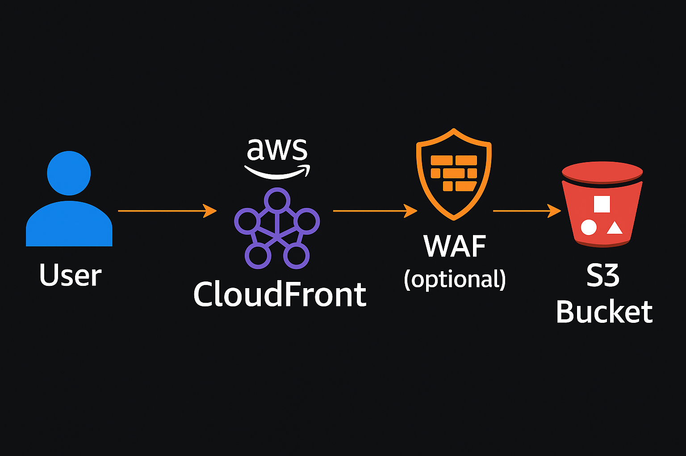

# AWS CloudFront Static Website Hosting

## 📌 Project Overview
This project demonstrates how to **host a static website on AWS S3** and deliver it globally using **Amazon CloudFront** for better performance and security.

### ✅ Features:
- Static website hosting using **Amazon S3**
- Global content delivery using **CloudFront**
- Optional **AWS WAF** for security
- Supports **HTTPS** via CloudFront SSL

---

## 🏗 Architecture

**Flow:**
1. Upload static files to **S3 Bucket**
2. Configure the bucket for static hosting
3. Create a **CloudFront distribution** pointing to the S3 bucket
4. Access the site via **CloudFront URL**

---

## ⚙️ AWS Services Used
- **Amazon S3** – Static file hosting
- **Amazon CloudFront** – CDN for global distribution
- **AWS IAM** – Permissions & policies
- **(Optional) AWS WAF** – Web application firewall

---

## 🚀 Steps to Deploy
1. Create an **S3 bucket** and upload website files.
2. Enable **static website hosting** on S3.
3. Create a **CloudFront distribution**:
   - Origin: Your S3 bucket
   - Default root object: `index.html`
4. Wait for CloudFront to deploy, then access the site using:
